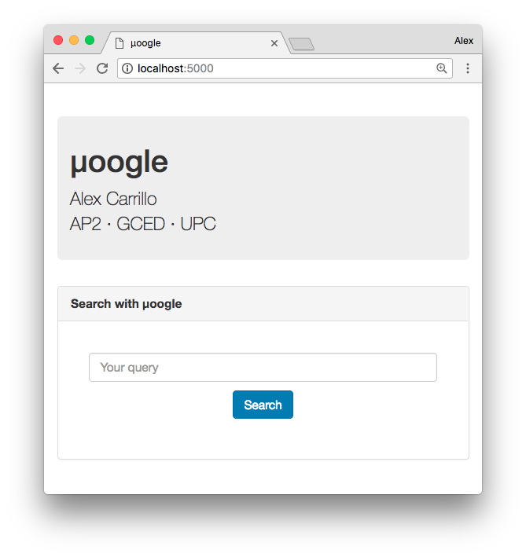
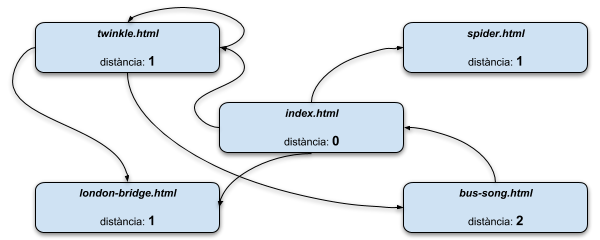
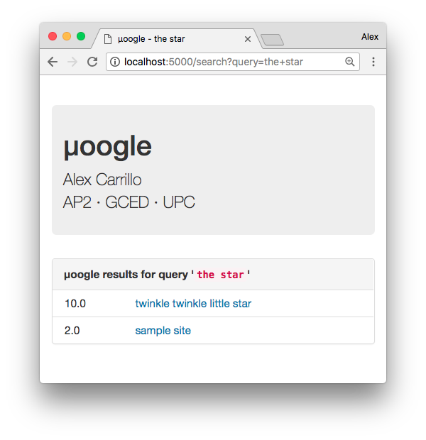

# µoogle

## 1. Introducció

El projecte µoogle es basa en un sistema per analitzar pàgines web i respondre consultes dels usuaris, informant de quines pàgines contenen totes les paraules de la cerca.



L’arquitectura de l’aplicació està formada per diversos components:

- El mòdul `server.py` és el servidor web que els usuaris utilitzaran per obtenir respostes a les seves consultes.

-	El mòdul `answer.py` és una eina que els desenvolupadors poden utilitzar per obtenir respostes a les seves consultes des del terminal.

-	El mòdul `crawler.py` és l'eina que s'utilitza per rastrejar la web i indexar les seves pàgines.

-	El mòdul `util.py` conté diverses funcions d'utilitat que s'utilitzen en els altres mòduls.

Finalment, el mòdul `moogle.py` conté el nucli de l’aplicació i és utilitzat pels altres mòduls.

## 2. El mòdul _crawler_

El _crawler_ és un rastrejador que visita algunes pàgines web i guarda informació sobre elles com: la url, el títol, les paraules que hi apareixen i quantes vegades es repeteixen. Aquesta informació és una base de dades referida com `db` en tot el projecte.

### 2.1. Estructura de la base de dades

La base de dades consisteix en un diccionari que associa una paraula a la llista de pàgines en les quals apareix. Més concretament, s’utilitzen aquestes estructures de dades una dins l’altre:

-	`diccionari = {}`

-	`diccionari[paraula] = {}`

-	`pag = {“score”: puntuacio, “title”: titol}`
-	`diccionari[paraula][url] = pag`

D’aquesta manera tenim un diccionari principal `diccionari` que associa una paraula a un altre diccionari `diccionari[paraula]` que combina urls amb un tercer diccionari `pag` que conté informació sobre la pàgina: el títol i la puntuació (un número real que representa les instàncies d’una paraula en una pàgina donada). Per exemple, per la paraula `'bridge'` tenim:

```text
'bridge': {'http://localhost:5000/static/index.html':
          {'score': 1.0, 'title': 'sample site'},
           'http://localhost:5000/static/twinkle.html':
          {'score': 1.0, 'title': 'twinkle twinkle little star'},
           'http://localhost:5000/static/london-bridge.html':
          {'score': 4.0, 'title': 'london bridge'}},
```

### 2.2. Implementació de la funció

La funció `crawler(url, maxdist)` analitza la web des d'una pàgina principal `url` fins a una distància màxima `maxdist` d'enllaços i retorna una base de dades.

La web s'interpreta como un graf de mida desconeguda al qual se li assigna una profunditat màxima. Per tant, s'utilitza l'**algorisme BFS** (_Breadth First Search_) per realitzar un recorregut en amplada des de la pàgina principal fins a les pàgines veïnes que no superin la distància màxima.



En la implementació s’utilitza una cua `deque()` on es van introduint les pàgines i un diccionari `visitats = {url: distancia}` que controla a quina distància es troba cadascuna:

1. Afegim la pàgina principal a la cua.

2.	Obtenim informació de la primera pàgina de la cua: el text (les paraules) i el títol.

3.	Per a cada paraula de la pàgina, si es nova, l’afegim al diccionari (amb la seva informació relativa). Si ja havíem vist la paraula, augmentem la seva puntuació.

4.	Trobem les pàgines veïnes (enllaços) de la pàgina que hem analitzat.

5.	Per a cada veí de la pàgina, si no l’hem visitat, l’afegim a la cua i augmentem la seva distància una unitat. Altrament el rebutgem.

6.	Repetim 2, 3, 4 i 5 fins que arribem a una pàgina amb distància màxima.

7.	Analitzem les pàgines que quedin pendents a la cua.

### 2.3. Característiques clau

El sistema de puntuació està basat en el nombre d’ocurrències d’una paraula en una pàgina específica. És a dir, una paraula repetida moltes vegades en una pàgina tindrà una puntuació més alta que una que només aparegui una vegada.

> S’emmagatzema en quines pàgines es troba una paraula i quantes instàncies de la paraula hi ha en cadascuna de les pàgines.

Pensant en els desenvolupadors a l’hora de depurar el programa, en la sortida del terminal es mostra en tot moment informació de la pàgina que s’està analitzant (títol, paraules, enllaços, etc.) i les pàgines restants a la cua.

> Es mostra informació relativa al procés de rastreig que pot ser guardada en un fitxer (utilitzant `| tee` o `|& tee` en el terminal) per a posteriors revisions.

### 2.4. Exemple

Per executar-lo, utilitzem l'ordre `./crawler.py –url http://localhost:5000/static/index.html --maxdist 4` i per a cada pàgina obtenim la sortida:
```text
_________________________
 Analitzant la pàgina...

  ➤    TÍTOL:    sample site

  ➤      URL:    http://localhost:5000/static/index.html

  ➤ PARAULES:    33           sample  ...  luck

  ➤ ENLLAÇOS:    3
                   •  http://localhost:5000/static/twinkle.html
                   •  http://localhost:5000/static/london-bridge.html
                   •  http://localhost:5000/static/spider.html

                 Queden 3 pàgines per analitzar.
```

### 3. El mòdul _answer_

En el mòdul answer, el servidor web carrega la base de dades i processa les consultes dels usuaris (una cadena de paraules). Com a resultat es mostra quines pàgines contenen totes les paraules de la cerca.

### 3.1. Estructura de la base de dades

En aquest apartat, primerament treballem amb la base de dades prèviament creada (el diccionari de diccionaris) `db` amb la qual trobarem les interseccions de cada paraula consultada. Més tard, construirem la llista de pàgines amb el format correcte que requereix el programa `answer.py`, una llista de diccionaris amb tres camps:

-	`title`: el seu títol
-	`url`: la seva url
-	`score`: la seva puntuació

### 3.2. Implementació de la funció

La funció `answer(db, query)` retorna una llista ordenada per puntuació en ordre descendent de pàgines de la base de dades `db` per a la consulta de paraules donades `query`.

La cerca de les llistes per a múltiples paraules consultades s’efectua calculant la intersecció de la llista de cada parell de paraules. Es comença amb les paraules 1 i 2, es calcula la intersecció d’ambdues, es calcula la intersecció de la paraula 3 i així consecutivament.

Per a consultes d’una sola paraula, s’evita el càlcul de cap intersecció i es retorna directament la llista de pàgines associada.

En la implementació s’utilitza l’operador `&` per calcular la intersecció entre els diccionaris i la funció `sorted()` per ordenar les llistes segons la url i la puntuació:

1. Calculem la intersecció de les llistes de les paraules.

2. Construïm la llista de pàgines amb el format correcte.

3. Ordenem la llista de pàgines segons les URLs.

4. Eliminem les pàgines repetides i, a més, sumem la puntuació de la pàgina repetida a ella mateixa.

5. Finalment, ordenem la llista de pàgines segons la puntuació en ordre descendent.

### 3.3. Característiques clau

L’eliminació de les pàgines repetides i el sumatori de les puntuacions d’aquestes permeten saber quina pàgina conté més instàncies de totes les paraules consultades. Això ens permet donar més rellevància a una pàgina o una altra en funció del nombre de paraules consultades que conté.

> Es mostra la llista de pàgines en ordre de rellevància segons el nombre d’ocurrències de les paraules consultades.

### 3.4. Exemple

Per executar-lo, utilitzem la comanda: `./answer.py --query "the star" --database moogle.dat` i obtenim la sortida:

```text
[{'score': 10.0,
  'title': 'twinkle twinkle little star',
  'url': 'http://localhost:5000/static/twinkle.html'},
 {'score': 2.0,
  'title': 'sample site',
  'url': 'http://localhost:5000/static/index.html'}]
```

També podem utilitzar l’aplicació web directament: [http://localhost:5000/](http://localhost:5000/).



## 4. Gestió d’errors i excepcions

Com que aquesta aplicació realitza tasques delicades i utilitza moltes funcions que poden generar imperfeccions en els resultats, ambdues funcions `crawler()` i `answer()` gestionen els errors i les excepcions amb el mecanisme:

```python
def crawler(url, maxdist):
  # ...
  try:
    # ...
    # Intentem obtenir informació de la pàgina.
    # ...
  except:
    # ...
    print(" No s'ha pogut anal·litzar la pàgina.")
    # ...
  # ...

def answer(db, query):
  # ...
  try:
    # ...
    # Intentem obtenir les consultes de les paraules.
    # ...
  except:
    # ...
    print("La cerca no ha obtingut cap resultat.")
    # ...
  # ...
```

Aquest mecanisme ens permet no aturar l’execució del _crawler_ en el cas que una pàgina no s’obri correctament o no es pugui analitzar i ens serveix per retornar una llista buida en el cas que consultem una paraula que no es troba en el diccionari.

## 5. Llibreries i dependències

Per instal·lar les llibreries de Python necessàries, executeu aquesta ordre:

```text
pip3 install -r requirements.txt
```

A més, s'han utilitzat altres funcions que necessiten incloure altres llibreries:

- `urljoin()`:
  ```python
  from urllib.parse import urljoin
  ```

- `deque()`:
  ```python
  from collections import deque
  ```
